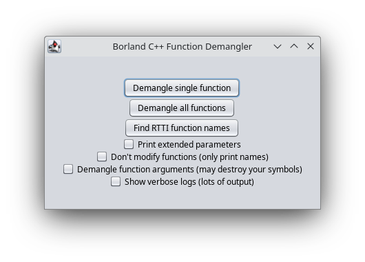

# Borland C++ Demangler

### A script for Ghidra to demangle function names and apply types to functions

**Note:** Ghidra supports only adding C types to functions. If a C++ type is detected by the demangler, the function will receive a type substituted with "undefined4" instead.

To use, open `Script Manager` and add this directory to `Script Directories` list. Then choose `BorlandCPPDemangler.java` and run it.
